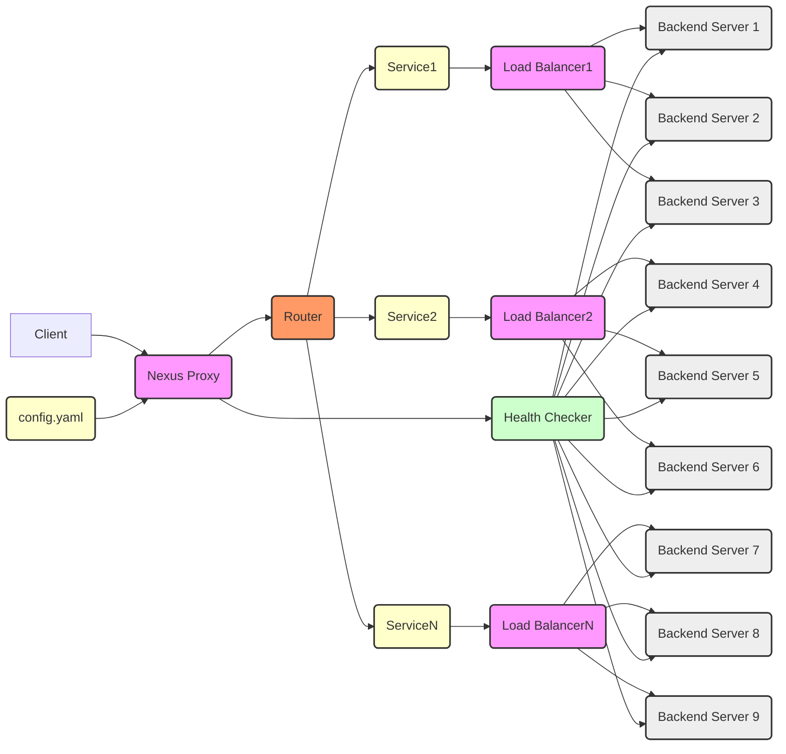

# Nexus - High-Performance Reverse Proxy and Load Balancer

**Nexus** is a lightweight, high-performance reverse proxy and load balancer written in Go. It aims to provide a fast, reliable, and scalable solution for managing and routing network traffic.



## Features

* **High Performance**: Built using Go and efficient network programming techniques, delivering excellent performance and low latency.
* **Load Balancing**: Supports multiple load balancing algorithms (e.g., round-robin, weighted round-robin, least connections) to intelligently distribute requests based on backend server health and load conditions.
* **Health Checking**: Built-in health check mechanism that regularly monitors backend server availability, automatically removes unhealthy servers to ensure service stability and reliability.
* **Flexible Configuration**: Uses YAML configuration files for management, easy to configure and maintain. Supports dynamic configuration updates without service restart.
* **Extensibility**: Modular design, easy to extend and customize. New functional modules can be added as needed, such as authentication, rate limiting, monitoring, etc.
* **Easy Deployment**: Compiles into a single executable file for simple deployment. Supports Docker deployment.

## Quick Start

### Prerequisites

* Go 1.22.5 or higher

### Installation

1. **Clone Repository:**

    ```bash
    git clone https://github.com/rust17/nexus.git
    cd nexus
    ```

2. **Build Project:**

    ```bash
    go build -o nexus cmd/main.go
    ```

    This will generate an executable file `nexus` in the current directory.

### Configuration

1. **Copy Configuration File:**

    Copy the `configs/config.yaml` file to the directory where you want to run `nexus`, such as the current directory.

    ```bash
    cp configs/config.yaml ./config.yaml
    ```

2. **Edit Configuration File:**

    Open the `config.yaml` file and modify the configuration according to your needs. For detailed configuration explanation, refer to the [Configuration Details](#configuration-details) section.

    ```yaml
    # config.yaml example

    listen_address: ":8080"  # listening address
    services:
      - name: "api-service"
        balancer_type: "round_robin"
        servers:
          - address: "http://localhost:8081"
          - address: "http://localhost:8082"
    routes:
      - name: user_route
        match:
          path: "/api/v1/users/**"  # Path wildcard
        service: api-service      # Associated backend service
    ```

### Running

1. **Start Nexus:**

    ```bash
    ./nexus -config config.yaml
    ```

    Or, if you placed the configuration file in the default location (`./config.yaml` or `/etc/nexus/config.yaml`), you can run it directly:

    ```bash
    ./nexus
    ```

2. **Access Proxy Service:**

    Now you can access the Nexus reverse proxy service through the configured listening address (e.g., `http://localhost:8080`). Requests will be load balanced to the backend servers.

## Configuration Details

The `config.yaml` file is used to configure the behavior of the Nexus reverse proxy and load balancer. Here's a detailed explanation of the configuration file:

```yaml
# Proxy server listening address
listen_addr: ":8080"

# Log level (debug, info, warn, error, fatal)
log_level: "info"

# Service configuration
services:
  - name: "api-service"                    # Service name (required)
    balancer_type: "weighted_round_robin"  # Load balancer algorithm (round_robin, least_connections, weighted_round_robin)
    servers:                               # List of backend servers
      - address: "http://localhost:8081"   # Server address (required)
        weight: 3                          # Server weight for weighted algorithms (optional, default: 1)
      - address: "http://localhost:8082"
        weight: 2
      - address: "http://localhost:8083"
        weight: 1

# Health check configuration
health_check:
  enabled: true           # Enable health check
  interval: 10s           # Check interval
  timeout: 2s             # Timeout duration
  path: "/health"         # Health check path (HTTP)

# Telemetry configuration
telemetry:
  opentelemetry:
    enabled: false                # Enable OpenTelemetry
    endpoint: "otel-collector:4317"  # OpenTelemetry collector endpoint
    service_name: "nexus-lb"      # Service name for telemetry
    metrics:
      interval: "60s"             # Metrics collection interval

# Route configuration
routes:
  - name: user_route              # Route name
    match:                        # Route matching criteria
      path: "/api/v1/users/**"    # Path pattern with wildcard support
      headers:                    # Header matching (optional)
        X-Service-Group: "v2"
      method: "GET"               # HTTP method matching (optional)
      host: "api.example.com"     # Host header matching (optional)
    service: api-service          # Target service name
```

## Directory Structure

```
nexus/
├── .gitignore
├── api/                    # API definitions and interfaces
├── cmd/                    # contains executable files for the project
│   └── main.go             # main program entry
├── configs/
│   └── config.yaml         # configuration file for configuring the proxy server
├── internal/               # internal packages not meant for external use
│   ├── balancer/
│   │   ├── balancer.go     # load balancer interface
│   │   ├── weighted_round_robin.go # weighted round-robin load balancer implementation
│   │   ├── round_robin.go  # round-robin load balancer implementation
│   │   └── least_connections.go # least connections load balancer implementation
│   ├── config/             # configuration management
│   ├── health/             # health check implementation
│   ├── logger/             # logger implementation
│   ├── proxy/              # proxy implementation
│   └── router/             # request routing implementation
├── pb/                     # contains protobuf definitions and generated code
│   ├── nexus.pb.go
│   └── nexus_grpc.pb.go
├── scripts/                # utility scripts for development, testing, and deployment
├── test/                   # test files
│   ├── benchmark_test.go   # performance benchmark tests
│   ├── integration_test.go # integration tests
│   └── stress_test.go      # stress tests
├── web/                    # web interface assets and code
├── go.mod                  # Go module definition
└── go.sum                  # Go module dependency checksums
```

## Usage Examples

### HTTP Reverse Proxy

Configure the `config.yaml` file as follows:
```yml
listen_addr: ":8080"
services:
  - name: "api-service"
    servers:
      - address: "http://192.168.1.100:8081"
routes:
  - name: "api-route"
    match:
      path: "*"
      host: "api.example.com"
    service: "api-service"
```

After starting Nexus, all HTTP requests sent to `http://localhost:8080` will be proxied to the backend servers `192.168.1.100:8081`.

### Route Configuration with Traffic Splitting

Configure the `config.yaml` file as follows:
```yaml
listen_addr: ":8080"
services:
  - name: "api-v1"
    balancer_type: "round_robin"
    servers:
      - address: "http://api-v1-1:8081"
      - address: "http://api-v1-2:8081"
  - name: "api-v2"
    balancer_type: "round_robin"
    servers:
      - address: "http://api-v2-1:8082"
      - address: "http://api-v2-2:8082"
routes:
  - name: "api-canary"
    match:
      path: "/api/**"
      headers:
        X-Debug: "true"
    split:
      - service: "api-v1"
        weight: 80
      - service: "api-v2"
        weight: 20
  - name: "api-stable"
    match:
      path: "/api/**"
    service: "api-v1"
```

This configuration demonstrates a canary deployment setup where:
1. Requests with the header `X-Debug: true` will be split between api-v1 (approximately 80%) and api-v2 (approximately 20%)
2. All other API requests will be routed to api-v1 only

### Path-based Routing Configuration and Load Balancing

Configure the `config.yaml` file as follows:
```yaml
listen_addr: ":8080"
services:
  - name: "user-service"
    balancer_type: "least_connections"
    servers:
      - address: "http://user-service-1:8081"
      - address: "http://user-service-2:8081"
  - name: "order-service"
    balancer_type: "round_robin"
    servers:
      - address: "http://order-service-1:8082"
      - address: "http://order-service-2:8082"
  - name: "product-service"
    balancer_type: "weighted_round_robin"
    servers:
      - address: "http://product-service-1:8083"
        weight: 3
      - address: "http://product-service-2:8083"
        weight: 1
health_check:
  enabled: true
  interval: 5s
  timeout: 2s
  path: "/health"
routes:
  - name: "user-route"
    match:
      path: "/api/users/**"
    service: "user-service"
  - name: "order-route"
    match:
      path: "/api/orders/**"
    service: "order-service"
  - name: "product-route"
    match:
      path: "/api/products/**"
    service: "product-service"
```

After starting Nexus, requests will be routed to different microservices based on the path:
1. All requests starting with `/api/users/` will be routed to `user-service` using the least connections load balancing algorithm
2. All requests starting with `/api/orders/` will be routed to `order-service` using the round-robin load balancing algorithm
3. All requests starting with `/api/products/` will be routed to `product-service` using the weighted round-robin load balancing algorithm

This configuration makes Nexus an effective API gateway, distributing requests to the appropriate microservices while providing health checking and load balancing capabilities.

## Contributing

Contributions of any form are welcome! If you'd like to contribute to this project, please follow these steps:

1. Fork this repository
2. Create your Feature branch (`git checkout -b feature/your-feature`)
3. Commit your changes (`git commit -am 'Add some feature'`)
4. Push to the Feature branch (`git push origin feature/your-feature`)
5. Create a new Pull Request

Please ensure your code style is consistent with the existing project code and add appropriate unit tests.

## License

MIT
