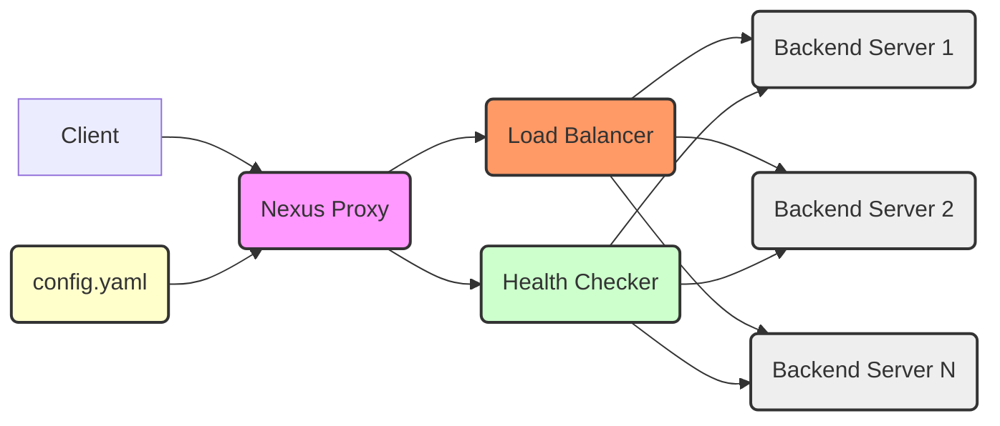

# Nexus - High-Performance Reverse Proxy and Load Balancer

**Nexus** is a lightweight, high-performance reverse proxy and load balancer written in Go. It aims to provide a fast, reliable, and scalable solution for managing and routing network traffic.



## Features

* **High Performance**: Built using Go and efficient network programming techniques, delivering excellent performance and low latency.
* **Load Balancing**: Supports multiple load balancing algorithms (e.g., round-robin, weighted round-robin, IP hash) to intelligently distribute requests based on backend server health and load conditions.
* **Health Checking**: Built-in health check mechanism that regularly monitors backend server availability, automatically removes unhealthy servers to ensure service stability and reliability.
* **Flexible Configuration**: Uses YAML configuration files for management, easy to configure and maintain. Supports dynamic configuration updates without service restart.
* **Extensibility**: Modular design, easy to extend and customize. New functional modules can be added as needed, such as authentication, rate limiting, monitoring, etc.
* **Easy Deployment**: Compiles into a single executable file for simple deployment. Supports Docker deployment.
* **gRPC Support**: Supports reverse proxy and load balancing for gRPC protocol.

## Prerequisites

* Go 1.16 or higher
* Protocol Buffer compiler (protoc)
* protoc-gen-go and protoc-gen-go-grpc plugins (for gRPC support)

## Quick Start

### Prerequisites

* Go 1.16 or higher
* Protocol Buffer compiler (protoc)
* protoc-gen-go and protoc-gen-go-grpc plugins (for gRPC support)

### Installation

1. **Clone Repository:**

    ```bash
    git clone https://github.com/yourusername/nexus.git
    cd nexus
    ```

2. **Build Project:**

    ```bash
    go build -o nexus cmd/main.go
    ```

    This will generate an executable file `nexus` in the current directory.

### Configuration

1. **Copy Configuration File:**

    Copy the `configs/config.yaml` file to the directory where you want to run `nexus`, such as the current directory.

    ```bash
    cp configs/config.yaml ./config.yaml
    ```

2. **Edit Configuration File:**

    Open the `config.yaml` file and modify the configuration according to your needs. For detailed configuration explanation, refer to the [Configuration Details](#configuration-details) section.

    ```yaml
    # config.yaml example

    proxy:
      listen_address: ":8080"  # listening address
      backend_servers:        # backend server list
        - address: "192.168.1.100:8081"
          weight: 10
        - address: "192.168.1.101:8081"
          weight: 5
      load_balancer: "round_robin" # load balancing algorithm, options: round_robin, weighted_round_robin, ip_hash
      health_check:
        enabled: true           # enable health check
        interval: "5s"          # health check interval
        timeout: "2s"           # health check timeout
        path: "/health"         # health check path (HTTP) or gRPC service method name (gRPC)
    ```

### Running

1. **Start Nexus:**

    ```bash
    ./nexus -config config.yaml
    ```

    Or, if you placed the configuration file in the default location (`./config.yaml` or `/etc/nexus/config.yaml`), you can run it directly:

    ```bash
    ./nexus
    ```

2. **Access Proxy Service:**

    Now you can access the Nexus reverse proxy service through the configured listening address (e.g., `http://localhost:8080`). Requests will be load balanced to the backend servers.

## Configuration Details

The `config.yaml` file is used to configure the behavior of the Nexus reverse proxy and load balancer. Here's a detailed explanation of the configuration file:

```yaml
proxy:
  listen_address: ":8080" # (required) listening address, e.g., ":8080", "0.0.0.0:80", "[::]:8080"
  backend_servers: # (required) backend server list
    - address: "192.168.1.100:8081" # backend server address, format: "host:port"
      weight: 10 # (optional) weight, used for weighted round-robin load balancing, default: 1
    - address: "192.168.1.101:8081"
      weight: 5
  load_balancer: "round_robin" # (optional) load balancing algorithm, options:
# - "round_robin": round-robin (default)
# - "weighted_round_robin": weighted round-robin
# - "ip_hash": IP Hash
health_check: # (optional) health check configuration
enabled: true # enable health check, default: false
interval: "5s" # health check interval, e.g., "5s", "1m", "300ms", default: "5s"
timeout: "2s" # health check timeout, e.g., "2s", "1s", "500ms", default: "2s"
path: "/health" # health check path (HTTP) or gRPC service method name (gRPC), default: "/health"
# - HTTP health check: Nexus will send an HTTP GET request to the /health path of the backend server.
# - gRPC health check: Nexus will call the Check method of the gRPC health check service, with the method name specified by the path.
protocol: "http" # health check protocol, options: "http", "grpc", default: "http"
logger: # (optional) logger configuration
level: "info" # log level, options: "debug", "info", "warn", "error", "fatal", default: "info"
format: "text" # log format, options: "text", "json", default: "text"
output: "stdout" # log output destination, options: "stdout", "stderr", "file", default: "stdout"
filename: "nexus.log" # when output is "file", specify the log file path, default: "nexus.log" (only effective when output is "file")
```

## Directory Structure

```
nexus/
├── .gitignore
├── cmd/                    # contains executable files for the project
│   └── main.go             # main program entry
├── configs/
│   └── config.yaml         # configuration file for configuring the proxy server
├── internal/
│   ├── balancer.go         # load balancer implementation
│   ├── config.go           # configuration management
│   ├── healthcheck.go      # health check implementation
│   ├── logger.go           # logger implementation
│   └── proxy.go            # proxy implementation
├── pb/                     # contains protobuf definitions and generated code
│   ├── nexus.pb.go
│   └── nexus_grpc.pb.go
├── test/
│   ├── balancer_test.go    # load balancer tests
│   ├── benchmark_test.go   # performance benchmark tests
│   ├── config_test.go      # configuration loading tests
│   ├── healthcheck_test.go # health check tests
│   ├── integration_test.go # integration tests
│   ├── logger_test.go      # logging tests
│   ├── proxy_test.go       # reverse proxy tests
│   └── stress_test.go      # stress tests
├── go.mod
└── go.sum
```

## Usage Examples

### HTTP Reverse Proxy and Load Balancing

Configure the `config.yaml` file as follows:
```yml
proxy:
  listen_address: ":8080"
  backend_servers:
    - address: "192.168.1.100:8081"
    - address: "192.168.1.101:8081"
  load_balancer: "round_robin"
  health_check:
    enabled: true
path: "/health"
protocol: "http"
```

After starting Nexus, all HTTP requests sent to `http://localhost:8080` will be round-robin load balanced to the backend servers `192.168.1.100:8081` and `192.168.1.101:8081`. Nexus will periodically check the `/health` path of the backend servers to ensure that only requests are sent to healthy servers.

### gRPC Reverse Proxy and Load Balancing

Configure the `config.yaml` file as follows:
```yaml
proxy:
  listen_address: ":8080"
  backend_servers:
    - address: "192.168.1.100:8081"
    - address: "192.168.1.101:8081"
  load_balancer: "weighted_round_robin"
  health_check:
    enabled: true
path: "grpc.health.v1.Health/Check" # gRPC health check service method name
protocol: "grpc"
```

After starting Nexus, all gRPC requests sent to `localhost:8080` will be weighted round-robin load balanced to the backend gRPC servers. Nexus will use the gRPC health check service (`grpc.health.v1.Health/Check`) to check the health status of the backend servers.

## Contributing

Contributions of any form are welcome! If you'd like to contribute to this project, please follow these steps:

1. Fork this repository
2. Create your Feature branch (`git checkout -b feature/your-feature`)
3. Commit your changes (`git commit -am 'Add some feature'`)
4. Push to the Feature branch (`git push origin feature/your-feature`)
5. Create a new Pull Request

Please ensure your code style is consistent with the existing project code and add appropriate unit tests.

## License

MIT
