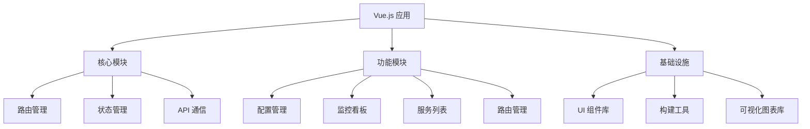
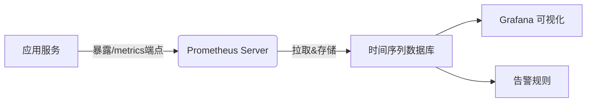
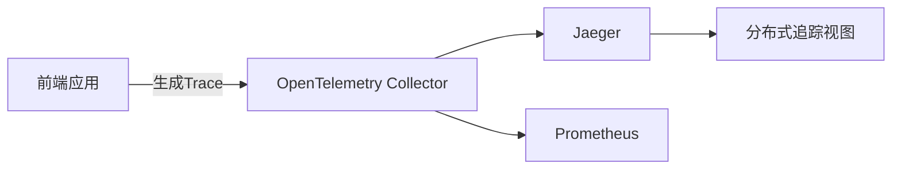
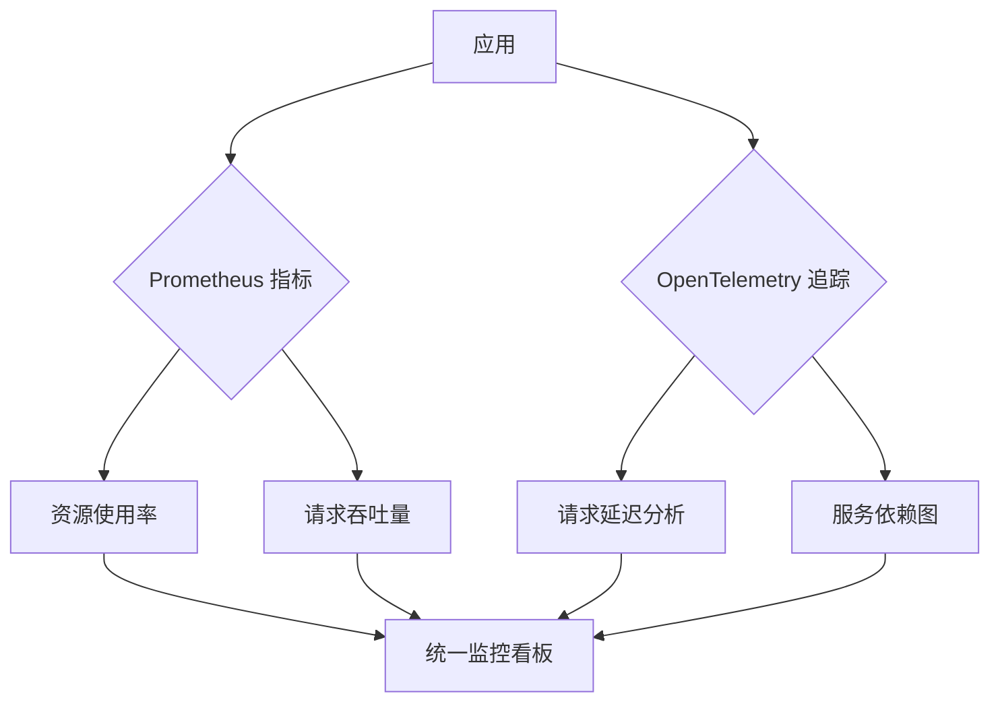
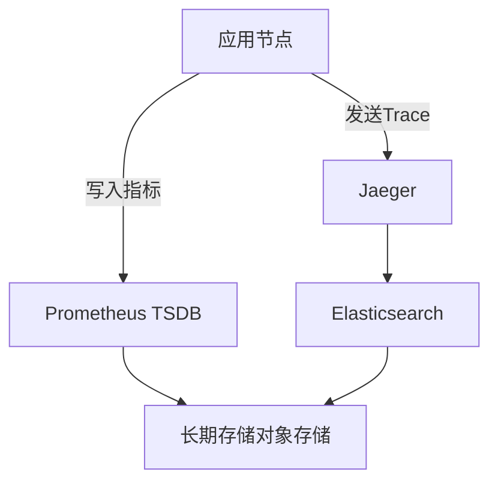

# Nexus 控制面板架构设计

## 前端架构


## 核心模块设计

1. **API 通信层**
- 封装与 Nexus 后端的 REST/gRPC 接口交互
- 统一错误处理机制
- 请求拦截器（加载状态/错误提示）

2. **状态管理**
- 使用 Vuex/Pinia 管理全局状态
- 核心状态对象：
  ```javascript
  {
    config: {},       // 当前配置
    services: [],     // 服务列表
    metrics: {},      // 性能指标
    routes: [],       // 路由配置
    healthStatus: {}  // 健康状态
  }
  ```

3. **路由系统**
- 定义功能模块路由表：
  ```javascript
  const routes = [
    { path: '/config', component: ConfigEditor },
    { path: '/services', component: ServiceList },
    { path: '/metrics', component: MetricsDashboard },
    { path: '/routes', component: RouteManager }
  ]
  ```

## 功能模块设计

1. **配置管理界面**
- YAML 编辑器与表单视图切换
- 配置版本对比功能
- 实时校验与保存状态提示

2. **监控看板**
- 实时流量可视化（请求数/错误率）
- 资源使用图表（CPU/内存/连接数）
- 健康状态热力图

3. **服务管理**
- 节点状态卡片式展示
- 权重调整拖拽控件
- 健康检查启停开关

4. **路由管理**
- 路由规则矩阵视图
- 路径匹配条件构建器
- 负载策略可视化配置

## 技术选型建议

| 类别         | 推荐方案               | 说明                          |
|--------------|----------------------|-----------------------------|
| UI 框架      | Element Plus         | 丰富的企业级组件                |
| 可视化       | ECharts              | 高性能图表库                   |
| 状态管理     | Pinia                | Vue 官方推荐状态管理方案         |
| 构建工具     | Vite                 | 快速开发体验                   |
| 代码规范     | ESLint + Prettier    | 统一代码风格                   |
| 组件库       | VueUse               | 常用组合式API工具集             |

## 后端接口需求

1. 配置管理接口
- 思路：支持YAML每个部分的独立配置
- `GET /api/v1/config` 获取当前配置
- `PUT /api/v1/config/listen_addr` 更新监听地址
- `PUT /api/v1/config/balancer_type` 更新负载均衡器类型
- `PUT /api/v1/config/servers` 更新后端服务器列表
- `PUT /api/v1/config/health_check` 更新健康检查配置
- `PUT /api/v1/config/log_level` 更新日志级别

2. 监控指标接口
- 思路：集成Prometheus指标暴露和OpenTelemetry追踪
- 什么是 Prometheus 指标暴露

- 什么是 OpenTelemetry 追踪

- nexus 如何协同 Prometheus 和 OpenTelemetry 工作

- nexus 如何写入 Prometheus 和 OpenTelemetry 数据

- [ ] Prometheus `GET /api/v1/metrics` 暴露节点指标 待实现
  - /api/v1/metrics 端点暴露节点级指标
  - 实时流量统计（请求数/错误率）
  - 资源使用指标（CPU/内存/连接数）
- [ ] OpenTelemetry 追踪
  1. 配置示例：
    ```yaml
    # config.yaml
    telemetry:
      opentelemetry:
        enabled: true
        endpoint: "http://collector:4317"
        service_name: "nexus-lb"
        metrics:
          interval: "60s"
    ```
  2. 请求入口追踪（负载均衡中间件）
     - 记录负载均衡策略和后端节点数
     - 创建贯穿整个请求链路的追踪上下文
  3. 路由匹配追踪
     - 捕获实际匹配的路由规则
     - 记录请求转发目标服务
     - 跟踪路径匹配算法的执行耗时
  4. 健康检查追踪
     - 关联服务ID与检查类型
     - 记录检查结果和响应时间
     - 异常状态时添加错误日志
  5. 配置变更追踪（需在配置管理接口补充）
  6. 接口
  - `GET /api/v1/traces` 追踪数据查询
    参数：
    - service_id: 服务标识
    - min_duration: 最小耗时(ms)
    - limit: 分页大小
    ```json
    // 响应示例
    {
      "traces": [
        {
          "trace_id": "abc123",
          "duration": 145,
          "services": ["lb", "route", "backend"],
          "timestamp": "2023-07-20T08:30:00Z"
        }
      ],
      "next_page_token": "qwerty"
    }
    ```

  - `GET /api/v1/traces/{trace_id}` 追踪详情
    ```json
    // 响应示例
    {
      "spans": [
        {
          "name": "load_balancer",
          "duration": 12,
          "attributes": {
            "lb.strategy": "round_robin",
            "backend.count": 5
          }
        },
        {
          "name": "route_match",
          "duration": 8,
          "attributes": {
            "route.pattern": "/api/v1/*",
            "route.target": "user_service"
          }
        }
      ]
    }
    ```

3. 服务管理接口
- 思路：服务管理应聚焦于后端实例的生命周期和流量分配，通过API动态添加后端服务器到负载均衡器，负载均衡器根据后端服务器进行请求分发，需要确保线程安全
- `GET /api/v1/services` 获取服务列表 待实现
- `POST /api/v1/services/{id}/health` 健康检查控制 待实现

4. 路由管理接口（灵活）
- 思路：路由管理处理请求的路由策略和规则，定义路由规则，将请求转发到不同的后端服务器（基于Header/Path的AB测试），需要维护一个路由表，并在负载均衡器的基础上进行扩展，支持路径匹配、流量分割
- `GET /api/v1/routes` 获取路由配置(定义请求转发规则) 待实现
- `POST /api/v1/routes` 更新路由规则 待实现
